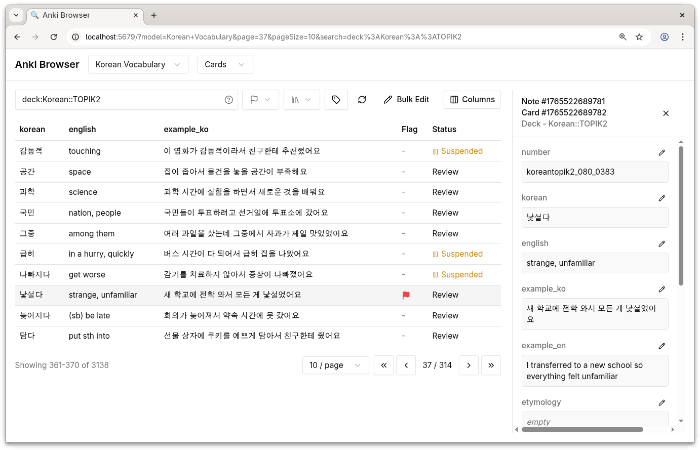

# anki-browse-web

Web-based browser for Anki notes, served via Anki add-on.



## Install

1. Download `anki-browse-web.ankiaddon` from [Releases](https://github.com/hi-ogawa/anki-tools/releases)
2. In Anki: Tools → Add-ons → Install from file
3. Restart Anki
4. Tools → Browse Web

## Development

```bash
pnpm i

# 1. Symlink addon to Anki's addons folder
pnpm dev-addon

# 2. Start/restart Anki (loads addon, API on :5679)
# ⚠️ Anki restart is needed when changing addon Python code.

# 3. Run UI dev server with hot reload and open http://localhost:5173
pnpm dev
```

## Fixture-based Development & Testing

Alternatively, you can develop and test with a standalone Anki API server (no Anki GUI required).

Requires [uv](https://docs.astral.sh/uv/) for Python dependency management.

```bash
uv sync         # Install Python dependencies
pnpm fixture    # Create test data

pnpm dev-fixture  # Develop UI with standalone API server
pnpm test-e2e     # Run E2E tests
```

## Build

```bash
# Build .ankiaddon package
pnpm build-addon
```
