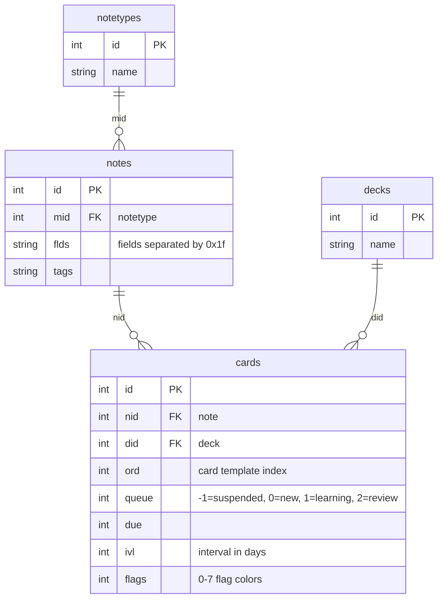

# Anki Database Schema

Quick reference for Anki's SQLite schema. See [AnkiDroid Wiki](https://github.com/ankidroid/Anki-Android/wiki/Database-Structure) for full details.

## Entity Relationships



## Key Relationships

- **notes.mid** → notetypes.id (note type / model)
- **cards.nid** → notes.id (parent note)
- **cards.did** → decks.id (deck assignment)

## Common Queries

```sql
-- Get all deck names for a specific notetype
SELECT DISTINCT decks.name
FROM cards
JOIN notes ON cards.nid = notes.id
JOIN decks ON cards.did = decks.id
WHERE notes.mid = ?;

-- Get notetype-deck associations
SELECT DISTINCT notes.mid, cards.did
FROM cards
JOIN notes ON cards.nid = notes.id;
```
