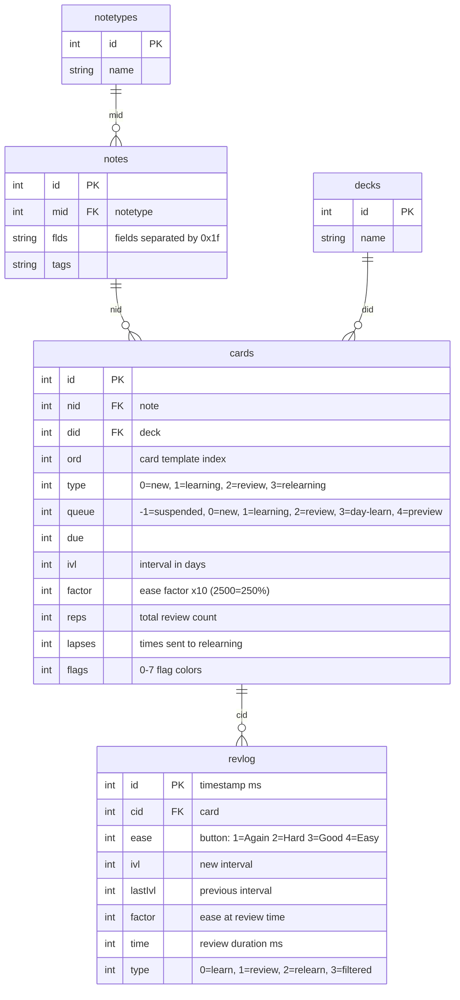

# Anki Database Schema

Quick reference for Anki's SQLite schema. See [AnkiDroid Wiki](https://github.com/ankidroid/Anki-Android/wiki/Database-Structure) for full details.

## Entity Relationships



## Key Relationships

- **notes.mid** → notetypes.id (note type / model)
- **cards.nid** → notes.id (parent note)
- **cards.did** → decks.id (deck assignment)

## Design Note: Notetype-First Browsing

A single deck can contain cards from **multiple notetypes**. Decks are just containers with no direct relationship to notetypes.

However, this browser uses **notetype-first** browsing:

1. Select a notetype first
2. Table columns are derived from that notetype's fields
3. Deck filter shows decks containing cards of the selected notetype

This design is intentional - each notetype has different fields (Basic: Front/Back, Cloze: Text/Extra, etc.), so we must know the notetype to render appropriate columns. The tradeoff is you browse one notetype at a time, not "all cards in a deck".

## Common SQL Queries

### Deck statistics

```sql
SELECT
    d.name as deck,
    COUNT(*) as cards,
    ROUND(AVG(c.factor)/10.0, 1) as avg_ease,
    SUM(c.lapses) as total_lapses,
    SUM(CASE WHEN c.lapses > 0 THEN 1 ELSE 0 END) as cards_with_lapses
FROM cards c
JOIN decks d ON c.did = d.id
WHERE c.queue >= 0
GROUP BY d.name;
```

### Problem cards (low ease)

```sql
SELECT
    SUBSTR(n.flds, 1, 50) as front,
    c.factor/10 as ease_pct,
    c.lapses,
    c.reps,
    c.ivl as interval_days
FROM cards c
JOIN notes n ON c.nid = n.id
WHERE c.factor < 2000  -- ease < 200%
ORDER BY c.factor ASC
LIMIT 50;
```

### Review time by day

```sql
SELECT
    DATE(id/1000, 'unixepoch', 'localtime') as day,
    COUNT(*) as reviews,
    ROUND(SUM(time)/1000.0/60, 1) as total_minutes,
    ROUND(AVG(time)/1000.0, 1) as avg_seconds
FROM revlog
WHERE id > (strftime('%s', 'now', '-14 days') * 1000)
GROUP BY day
ORDER BY day DESC;
```

### Retention estimate (reviews vs lapses)

```sql
SELECT
    COUNT(*) as total_reviews,
    SUM(CASE WHEN ease = 1 THEN 1 ELSE 0 END) as again_count,
    ROUND(100.0 - (100.0 * SUM(CASE WHEN ease = 1 THEN 1 ELSE 0 END) / COUNT(*)), 1) as retention_pct
FROM revlog
WHERE type = 1  -- review only (not learning)
  AND id > (strftime('%s', 'now', '-30 days') * 1000);
```
