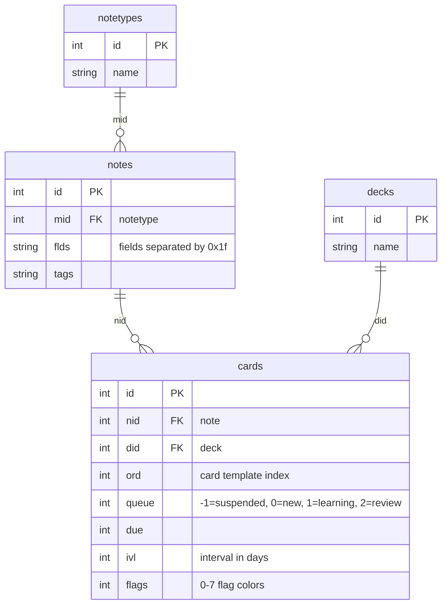

# Anki Database Schema

Quick reference for Anki's SQLite schema. See [AnkiDroid Wiki](https://github.com/ankidroid/Anki-Android/wiki/Database-Structure) for full details.

## Entity Relationships

## Key Relationships

- **notes.mid** → notetypes.id (note type / model)
- **cards.nid** → notes.id (parent note)
- **cards.did** → decks.id (deck assignment)

## Design Note: Notetype-First Browsing

A single deck can contain cards from **multiple notetypes**. Decks are just containers with no direct relationship to notetypes.

However, this browser uses **notetype-first** browsing:

1. Select a notetype first
2. Table columns are derived from that notetype's fields
3. Deck filter shows decks containing cards of the selected notetype

This design is intentional - each notetype has different fields (Basic: Front/Back, Cloze: Text/Extra, etc.), so we must know the notetype to render appropriate columns. The tradeoff is you browse one notetype at a time, not "all cards in a deck".
